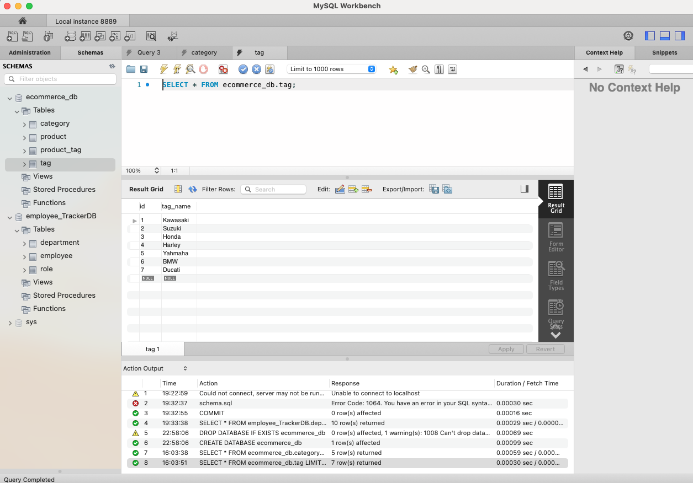
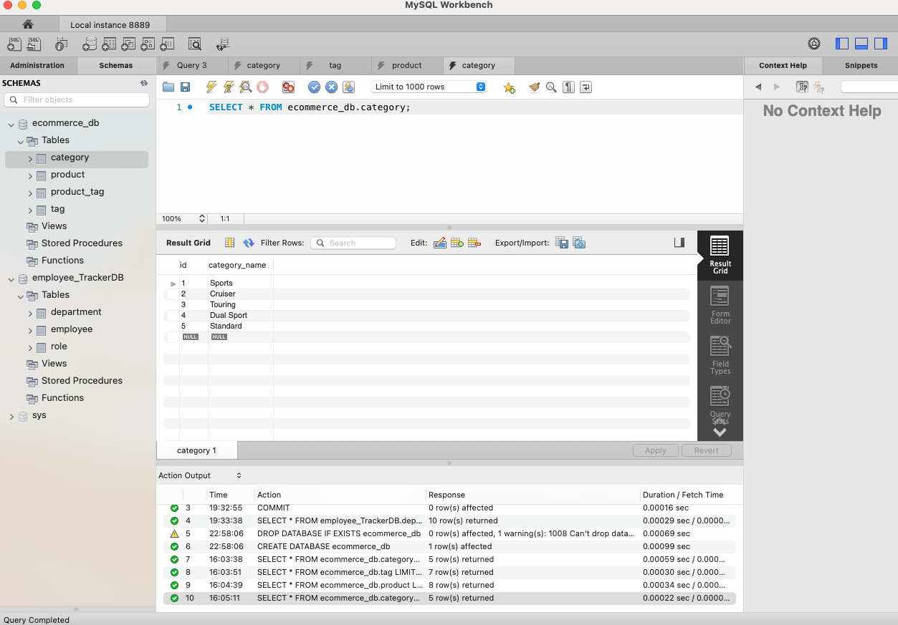
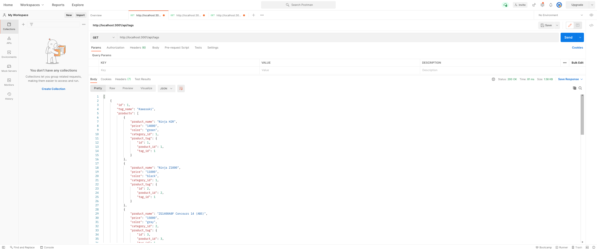
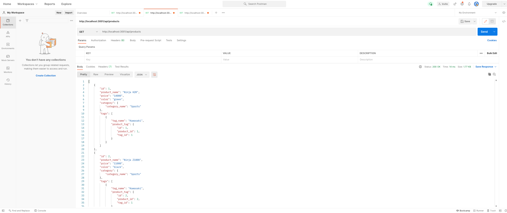
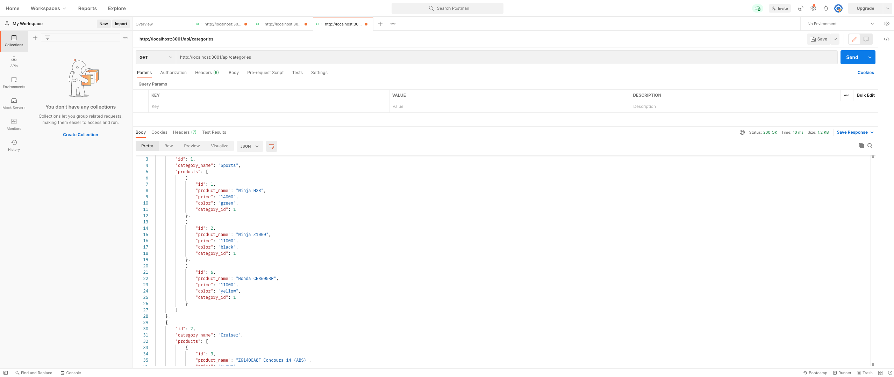

https://user-images.githubusercontent.com/79549867/120586160-00101f00-c401-11eb-9a94-76a2762ccbd7.mov

# E-Commerce-Back-End

## Description 

## "How to"

 In order to use the application, first ensure that MySQL is installed in your environment.    
 Then, from the project root folder enter the sql shell and run the following command:          

`npm i`
`source db/schema.sql`    

Exit the sql shell and return to the command line still within your root project folder.      
Run the following commands;          
`npm run seed`    
`npm start`    

/    

     

# eCommerce-back-end
# eCommerce-back-end
